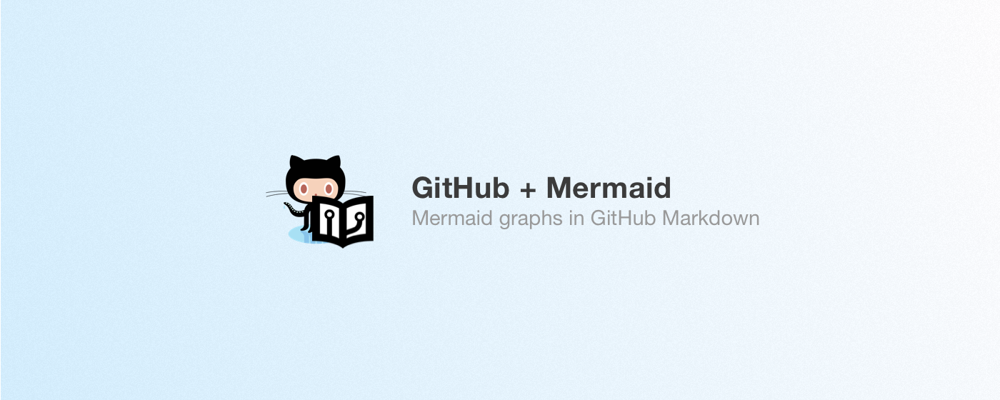

<div align="center">
  <h1>
    Github + Mermaid  
  </h1>

  <p>
    <strong>
      A browser extension for Chrome, Opera & Firefox that adds
      
      <a href="https://mermaidjs.github.io" target="_blank">Mermaid</a>
      language support to
      
      <a href="https://guides.github.com/features/mastering-markdown/" target="_blank">Github Markdown</a>.
    </strong>
  </p>
</div>

<div align="center">
  

  <nav align="center">
    <a href="#features">Features</a> •
    <a href="#install">Install</a> •
    <a href="#how-to-use">How to use</a> •
    <a href="#roadmap">Roadmap</a> •
    <a href="#license">License</a> •
    <a href="#contributing">Contributing</a>
  </nav>
</div>
<br>

## Install

- **Google Chrome**: [GitHub + Mermaid - Chrome Web Store](https://chrome.google.com/webstore/detail/github-%20-mermaid/goiiopgdnkogdbjmncgedmgpoajilohe)
- **Firefox**: coming soon
- **Opera**: coming later

## Features

### Supported GitHub features

- [x] Pull requests & issues description (preview + published) - [Demo](https://github.com/BackMarket/github-mermaid-extension/issues/1)
- [x] Pull requests & issues comment (preview + published)
- [x] Markdown (`.md`) files (diff + published)

### Diagram types

#### Flowcharts


<details>
  <summary>Show source code</summary>

  ```
  ```mermaid
  graph LR

  A(Start)

  A --> B[Look for an item]

  B --> C{Did you find it?}
  C -->|Yes| D(Stop looking)
  C -->|No| E{Do you need it?}
  E -->|Yes| B
  E -->|No| D
  ```
</details>

#### Sequence Diagrams


<details>
  <summary>Show source code</summary>

  ```
  ```mermaid
  sequenceDiagram
  participant U as User
  participant C as Client
  participant S as Server
  participant DB as Database

  U ->> C: Fill username
  U ->> C: Fill password
  C ->> U: Enable "Login" button
  U ->> C: Click "Login" button
  C ->>+ S: POST /login
  S ->>+ DB: SELECT FROM users
  Note over S,DB: See login.py for impl. details
  DB -->>- S: results
  S -->>- C: { authenticated: true }
  C ->> U: redirect /home
  ```
</details>

#### Gantt Diagrams


<details>
  <summary>Show source code</summary>

  ```
  ```mermaid
  gantt
      title A Gantt Diagram
      dateFormat  YYYY-MM-DD
      section Section
      A task           :a1, 2014-01-01, 30d
      Another task     :after a1  , 20d
      section Another
      Task in sec      :2014-01-12  , 12d
      another task      : 24d
  ```
</details>

## How to use

Simply put Mermaid code into <code>```mermaid</code>. See
[Mermaid official website](https://mermaidjs.github.io/gantt.html) for more
information about the Mermaid syntax.

## Roadmap

- [x] Initial implementation
- [x] Publish Chrome extension
- [x] Documentation
- [x] Publish Firefox extension
- [ ] Publish Opera extension
- [ ] Continuous Integration
- [ ] Upgrade dependencies
- [ ] Dark theme + option page

## License

[](/LICENSE.md)

## Contributing

Contributions (issues ♥, pull requests ♥♥♥) are more than welcome! Feel free to clone, fork, modify, extend, etc.

See [contributing intructions](/CONTRIBUTING.md) for details.
